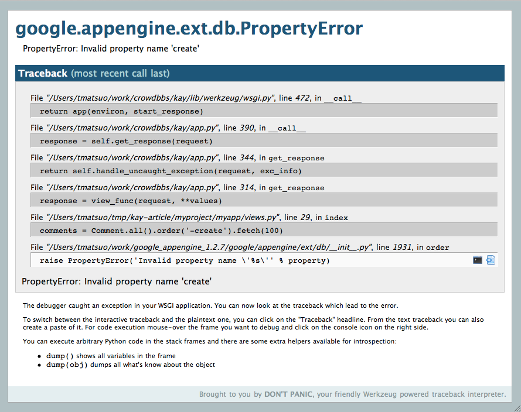
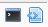
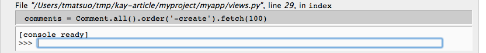
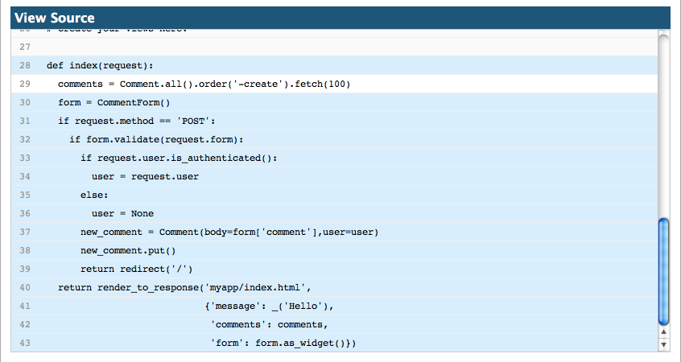
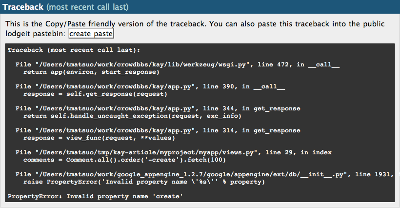
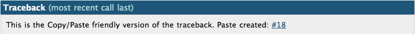
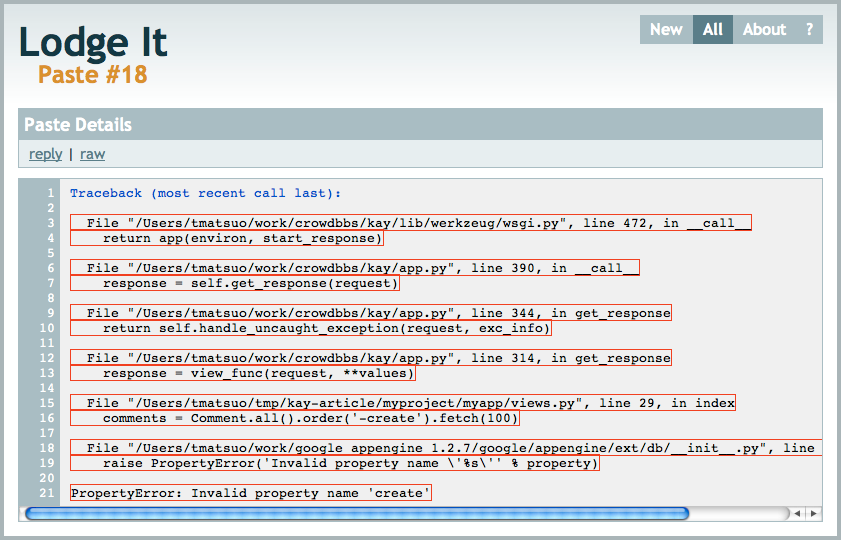

=======
Отладка
=======

Отладчик werkzeug
=================

Kay имеет встроенный отладчик библиотеки werkzeug, который по умолчанию 
задействован на локальном сервере разрабоки. К сожалению он не может быть 
использован в окружении серверной среды App Engine.

Этот отладчик рабтает в браузере разработчика и запускается, когда возникает
какое-либо исключение. Вы модете использовать интерактивную консоль и 
возможность просмотра исходного кода на каждом шаге трассировки стека, вплоть
до строчки, где произошло исключение.

Также вы можете просматривать трассировку стека в виде простого текста и 
вставлять его в сообщения интернет сервисов.

Экран отладчика
---------------

Когда возникает исключение на сервере разработки, вы можете увидеть примерно
такой экран:

На котором будут линии с исходным кодом каждого шага трассировки стека и если
вы наведете курсор мыши на любую из этих строчек, то в правой части данной
строки появятся иконки:

Если вы кликните по левой иконке, то под строкой появиться интерактивная
консоль. Если же вы кликните по правой иконке, то вы увидите исходный код файла
с подсвеченной строкой, в которой возникла проблема.

Интерактивная консоль
---------------------

Вот скриншот интерактивной консоли:

В этой консоли вы можете выполнять любой код на языке python, при этом вы будете
иметь доступ к значению всех переменных на момент возникновения исключения, что
очень полезно при отладке.

Например, вызвав функцию ``locals()``, результато вы получите словарь со всеми
локальными переменными:

.. code-block:: python

  [console ready]
  >>> locals()
  {'request': <Request 'http://localhost:8080/' [GET]>}
  >>>

Исправление опечатки и повторное выполнение кода, даст вам правильный результат.

.. code-block:: python

  [console ready]
  >>> comments = Comment.all().order('-created').fetch(100)
  >>> comments
  [<myapp.models.Comment object at 0x104c6c8d0>]
  >>> 

Если вы щелкните по иконке снова, то интерактивная консоль закроется.

Просмотр исходного кода
-----------------------

Это скриншот с окном отображающем исходный код, на котором вы можете видеть
подсвеченную линию, в которой произошло исключение.

Если вы кликните по заголовку с надписью ``View Source``, то окно просмотра
исходного кода будет закрыто.

Просмотр трассировки стека в виде обычного текста 
-------------------------------------------------

Если вам необходимо вставить трассировку стрека в e-mail или еще куда-то, то
вы можете кликнуть по заголовку с надписью ``Traceback``, как показано ниже:

Кликая на этот заголовок вы можете переключать отображение трассировки стека
между режимом отладки и режимом просмотра в виде простого текста. Вот пример
просмотра трассировки стека в виде простого текста:

Публикация вашей трассировки стека
----------------------------------

Когда вы находитесь в режиме просмотра трассировки стека в виде простого текста,
вы модете заметить кнопку ``create past``. Если вы кликните по этой кнопке, то
Kay опубликует вышу трассировку стека на 
`специальном сервисе <http://paste.shehas.net/>`_. Если отправка данных будет
успешной, то в результате будет показана ссылка на опубликованную  трассировку
на данном сервисе. 

Пот скриншот опубликованной трассировки стека:

Исключения в шаблонах Jinja2
----------------------------

Если исключение произошло в шаблоне Jinja2, то в отладчике вы увидите
неоформатированнй вывод трассировки. Это присходит из-за ограничений App Engine
(он не использует ctypes). Для решения этой проблемы, вы можете неного изменить
файл dev_appserver.py, находящийся в App Engine SDK.

После добавления ``gestalt`` и ``_ctypes`` в список ``_WHITE_LIST_C_MODULES``,
вы увидите нормальное отображение трассировки стека в отладчике.

Нужно заметить, что многие дистрибутивы python включают в себя 'поломанный'
ctypes (например, такую проблему имеет python25 из macports) и приведенное выше
решение не будет в них работать. В этом случае, скопируйте _speedups.so в
директорию ``kay/lib/jinja2``, взяв его из длугих инсталяций jinja2
(не из комплекта Kay) и затем добавьте '_speedups' в список
``_WHITE_LIST_C_MODULES`` файла dev_appserver.py App Engine SDK.
Если вы используете MacOSX, то самым простым путем получения
скопмилированного ``_speedups.so`` будет установка пакета py25-jinja2 из
macports.

Использование pdb
=================

Также, для отладки в среде разработки, вы можете использовать
`отладчик pdb <http://www.python.org/doc/2.5.4/lib/debugger-commands.html>`_.
Если вы вызовите :func:'kay.utils.set_trace' в любом месте вышего кода, то в
этом месте произойдет исключение и ваша программа будет остановлена, после чего
вы увидите строку приглашения отладчика pdb в консоли из которой вы вызвали 
``manage.py runserver``.

Например, вы может выполнять вашу программу шаг за шагом, используя комманду
``step``. Более подробную информаци. по использыванию отладчика pdb, вы можете
найти по следующему адресу:

* http://www.python.org/doc/2.5.4/lib/debugger-commands.html
